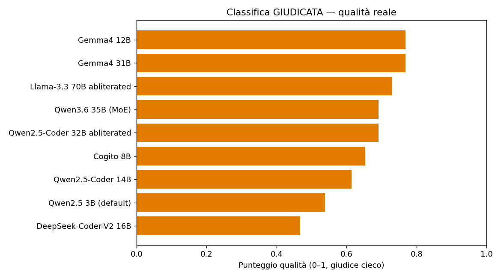
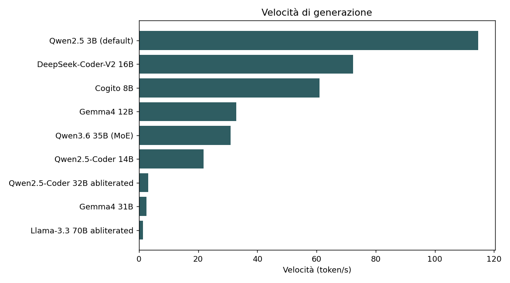
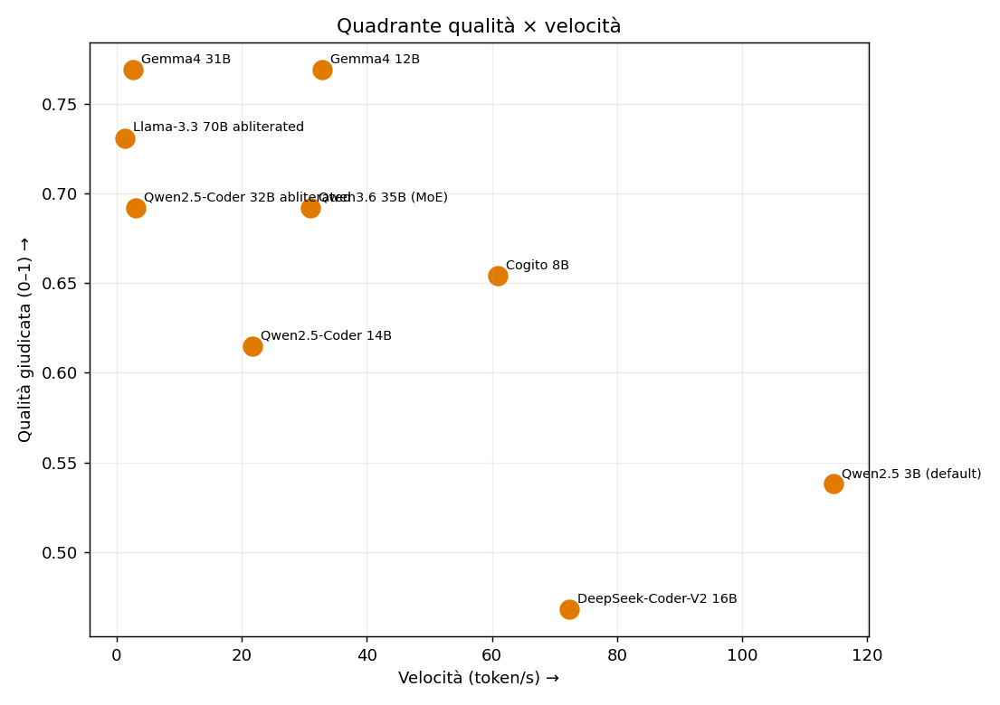
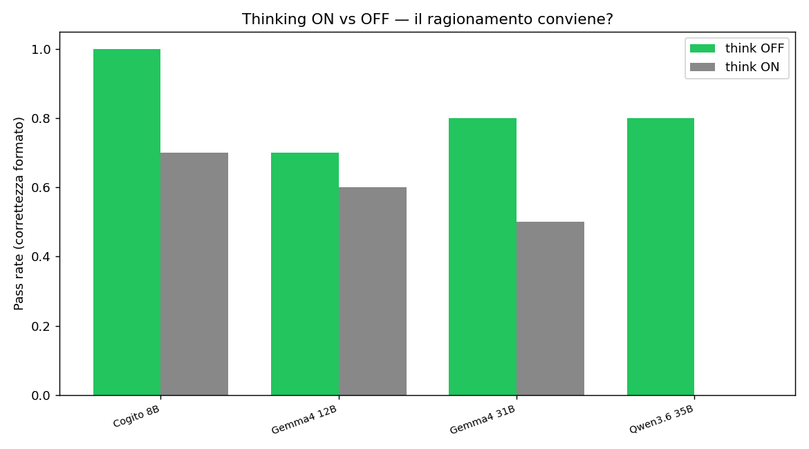

# Non esiste "il modello migliore"
### 9 modelli di AI in locale, su hardware da retrobottega, sui compiti veri di un gestionale

*Di [SudoWAI](https://sudowai.com) — software e AI in locale, senza Big Tech · Livorno.*

---

## In due righe
Abbiamo messo alla prova **9 modelli di intelligenza artificiale interamente in locale** (nessun cloud) sui compiti reali del nostro gestionale **SmartShop**. Conclusione netta e contro-intuitiva: **non vince sempre lo stesso modello, e il più grosso non è il migliore.** Un modello "piccolo" da 12 miliardi di parametri ha **eguagliato uno quasi tre volte più grande, andando ~13× più veloce** — battendo perfino un modello da 70 miliardi.

## Hardware
**RTX 3060 12GB + 31GB di RAM.** Niente di esotico: il tipo di macchina che può stare nel retro di un negozio. Tutto in locale, dati che non escono di casa.

## I 9 modelli
Qwen2.5 3B · Cogito 8B · **Gemma4 12B** · Qwen2.5-Coder 14B · DeepSeek-Coder-V2 16B · Gemma4 31B · Qwen3.6 35B (MoE) · Qwen2.5-Coder 32B *abliterated* · Llama-3.3 70B *abliterated*.

## I compiti (13, reali)
Classificare richieste in linguaggio naturale, estrarre un menù in dati strutturati, riconoscere allergeni, configurare il gestionale, dare consigli commerciali, scrivere ricette, scrivere e **rivedere** codice, copywriting, **generare siti web**. Tutto ciò che SmartShop chiede all'AI ogni giorno.

---

## Prima lezione (a nostre spese): i benchmark ingenui MENTONO
Il primo giro ha dato una classifica **assurda**: un modello da 3 miliardi primo, uno da 31 ultimo. Il motivo è la trappola in cui cascano tanti benchmark fai-da-te: **misuravano la forma, non la sostanza** (è un JSON valido? c'è la funzione? la lunghezza è giusta?) — cose che anche un modello piccolo fa benissimo. Così tutti prendevano il massimo, e i modelli migliori venivano perfino **penalizzati** perché scrivevano risposte più ricche che un controllo ingenuo tagliava.

Due correzioni hanno cambiato tutto:
1. **Niente penalità per il limite tecnico.** Decine di risposte erano solo *troncate* per poco spazio: le abbiamo rifatte con spazio abbondante.
2. **Un giudice vero, anzi tre.** Per i compiti aperti un controllo automatico non basta: un **modello giudice valuta alla cieca** (voto 1–5, rubrica). Come riprova **il modello risultato migliore ha rifatto da giudice**, e una **valutazione esterna indipendente** ha controllato un campione. *Se un benchmark dà a tutti 10, il benchmark è rotto.*

---

## Risultati (classifica giudicata)

| # | Modello | Qualità (0–1) |
|---|---------|---------------|
| 1 | **Gemma4 12B** | **0.77** |
| 1 | Gemma4 31B | 0.77 |
| 3 | Llama-3.3 70B abliterated | 0.73 |
| 4 | Qwen3.6 35B (MoE) | 0.69 |
| 4 | Qwen2.5-Coder 32B abliterated | 0.69 |
| 6 | Cogito 8B | 0.65 |
| 7 | Qwen2.5-Coder 14B | 0.62 |
| 8 | Qwen2.5 3B | 0.54 |
| 9 | DeepSeek-Coder-V2 16B | 0.47 |

**Il dato che conta:** **Gemma4 12B pareggia Gemma4 31B** (modello ~3× più grande) **e supera il Llama 70B.**

### E la velocità? Qui il quadro si ribalta

- Gemma4 **12B: ~33 token/s**
- Gemma4 **31B: ~2,6 token/s**
- Llama **70B: ~1,3 token/s**

Stessa qualità del 31B, **~13 volte più veloce**. I giganti, a parità (o meno) di qualità, sono **inutilizzabili** per il lavoro reale su questo hardware.

In alto a destra — bravi **e** veloci — ci finiscono i modelli **contenuti**, non i colossi.

### Chi vince su cosa
Modelli diversi vincono compiti diversi: i tre giudici concordano sul **cluster di testa** (modelli piccoli/medi) e sui **fanalini** (Qwen 3B, DeepSeek-Coder), e divergono solo sul "primo assoluto". Anche **scegliere il giudice è una scelta che pesa** → motivo in più per non fidarsi di una classifica unica. Dettaglio: [giudizio esterno](report/giudizio_claude.md).

---

## Thinking sì o no?
Abbiamo provato il "ragionamento esplicito" (*thinking*) acceso vs spento. Risultato chiaro: **quasi sempre peggiora** sui compiti strutturati.

- Cogito 8B: 100% → 70%
- Gemma4 31B: 80% → 50%
- **Qwen3.6 35B: 80% → 0%** (col thinking **rompe il formato JSON**)

Sui compiti concreti (configurazioni, dati, codice) il thinking **va tenuto spento**. Serve, semmai, solo sui compiti aperti/strategici.

---

## La tesi: non un cervello gigante, ma un buon direttore d'orchestra
> **Il valore non è nel modello più grande. È nel SISTEMA che manda il modello giusto a fare la cosa giusta.**

Un modello piccolo e veloce per capire e smistare; uno per il codice; uno per la visione (foto → prodotti); uno "stratega" solo quando serve. Un setup **contenuto** rende più di un singolo gigante generico — a una frazione di energia, **in locale**, senza mandare i dati di nessuno nel cloud. È esattamente il motore di **MARCO** (orchestrazione + routing + *merge* + quantizzazione dinamica) dietro **SmartShop**.

E lo conferma il mercato: persino **OpenAI ha chiuso Sora** perché la generazione video di frontiera costava **~1 milione di dollari al giorno**. La potenza bruta nel cloud non regge. La via sostenibile è l'efficienza.

---

## Riproducibilità
Tutto il codice è in questo repository: i 13 compiti (`tasks.py`), il runner (`run_bench.py`), la rigenerazione senza troncamenti (`run_open_clean.py`), le varianti thinking/caveman (`run_variants.py`), il giudice cieco (`judge.py`), i grafici (`make_charts.py`) e **tutti i dati grezzi** (`results/`). Chiunque può rifare i test sul proprio hardware.

*SudoWAI — Livorno. SmartShop (gestionale con AI locale), Serena (assistente WhatsApp), M.A.R.C.O. — self-hosted, niente Big Tech.*
