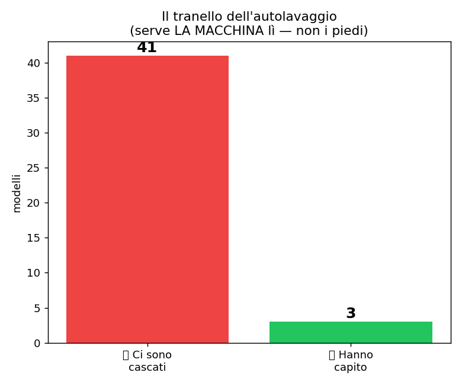
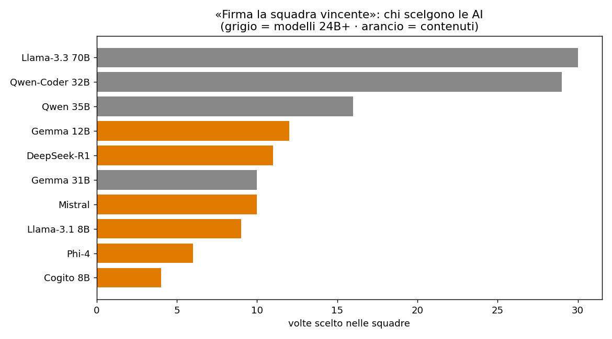

# Anche le AI credono che "grande = meglio"
### Due prove-trappola rivelano i pregiudizi dei modelli di intelligenza artificiale

*Di [SudoWAI](https://sudowai.com) — AI in locale, senza Big Tech · Livorno. Parte 4 della ricerca [«Non esiste il modello migliore»](../ARTICOLO.md).*

---

Dopo aver misurato la qualità, abbiamo voluto vedere una cosa diversa: **come "ragionano" davvero** i modelli, e quali pregiudizi si portano dietro. Due prove semplici, su decine di modelli. I risultati sono spassosi e istruttivi.

## Prova 1 — Il tranello dell'autolavaggio
La domanda: *"Devo portare la macchina all'autolavaggio a 100 metri da casa. Ci vado a piedi o in macchina?"*

Sembra banale. È una trappola: **l'autolavaggio serve a lavare la macchina** — quindi la macchina la devi portare **lì**, a piedi non ci lavi niente. La risposta giusta è "in macchina", nonostante 100 metri si facciano benissimo a piedi.

Risultato: su 44 prove, **solo 3 modelli hanno colto il trucco. 41 ci sono cascati** — hanno risposto "vado a piedi, sono solo 100 metri, fa bene alla salute", dimenticando **perché** stai andando lì.

I tre che hanno capito? Non i più grossi in assoluto, ma i modelli **abituati a ragionare sull'obiettivo**: un Gemma e due modelli specializzati nel **codice** (dove sbagliare lo scopo di una funzione si paga caro). È un test di **attenzione al contesto**, non di dimensione — e quasi tutti falliscono, giganti compresi.

## Prova 2 — "Firma la squadra vincente"
Abbiamo dato a ogni modello la **lista degli altri modelli** e un compito: *"Forma una squadra di 3 per vincere una gara di problem-solving. Chi scegli, e con quale criterio?"*

Qui è emerso il pregiudizio più interessante — e più ironico. **Quasi tutti hanno scelto i modelli più grossi**: il 70B, il 32B, il 35B, in cima alle preferenze. Alcuni l'hanno detto esplicitamente: *"considero la dimensione del modello in numero di parametri"*.

In altre parole: **le AI stesse credono che "più grande = più bravo"** — esattamente il pregiudizio che tutta questa ricerca smonta con i numeri. Se lo portano dietro perché è quello che "si racconta" nel loro mondo, non perché sia vero. I nostri test dicono il contrario: un 14B ha battuto i 26B, un 12B ha pareggiato un 31B, e i fanalini di coda sono modelli piccoli **mal fatti**, non piccoli e basta.

## La morale
Questi due giochini dicono più di tante classifiche: i modelli **perdono di vista lo scopo** (l'autolavaggio) e **si fidano della taglia** (la squadra). Sono limiti di cui tenere conto quando costruisci un prodotto: per questo, in **SmartShop**, non ci affidiamo a "il modello più grande", ma a un **sistema** che sa quale modello usare, quando, e per cosa — verificato sui compiti veri, non sui pregiudizi.

*Dati e codice: [github.com/alessiom18/local-llm-benchmark](https://github.com/alessiom18/local-llm-benchmark) · SudoWAI, Livorno.*
