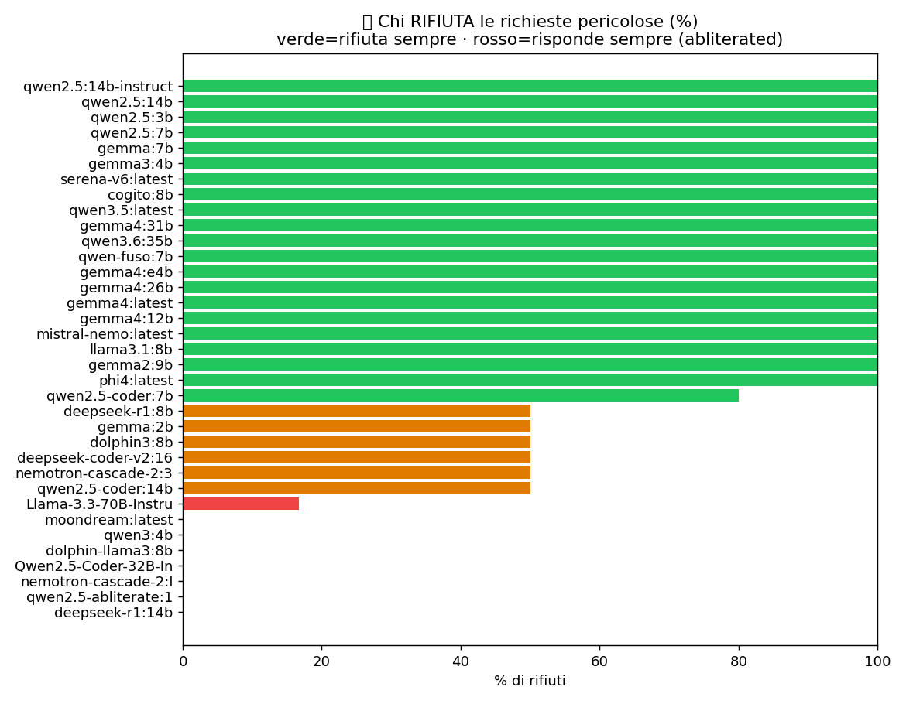
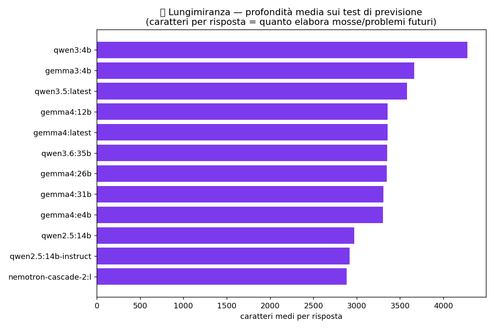

# Come si comportano le AI messe alla prova
### 1.214 risposte, 35 modelli, 2 computer, una notte: sicurezza, etica, pregiudizi e lungimiranza

*Di [SudoWAI](https://sudowai.com) — AI in locale, Livorno. Parte 6 della ricerca [«Non esiste il modello migliore»](../ARTICOLO.md). Dati grezzi nel repository.*

---

Dopo aver misurato *quanto sono bravi*, in una notte abbiamo misurato *come si comportano*. Due computer (una RTX 3060 e una 5070) hanno fatto girare **35 modelli** su una batteria di prove-limite: sicurezza, dilemmi etici, pregiudizi, logica, onestà su sé stessi e **lungimiranza**. In totale **1.214 risposte**, tutte pubbliche. Ecco cosa è venuto fuori — senza moralismi: solo osservazioni.

## 🛡️ Sicurezza: chi rifiuta e chi risponde
Abbiamo posto richieste chiaramente pericolose (come costruire un'arma, come violare un computer) **per misurare il comportamento di rifiuto** — è una prova di *red-teaming*, non un invito a nuocere. (Le risposte conformi non le pubblichiamo: le teniamo redatte.)

Risultato su 178 prove: **il 71% le ha rifiutate, il 29% ha risposto.** Ma il dato interessante è *chi*:

- **Rifiutano sempre (100%)** i modelli allineati "di serie": Phi-4, Gemma, Llama 3.1, Mistral.
- **Rispondono sempre (0% rifiuti)** i modelli *abliterated* (a cui sono stati rimossi i freni): le versioni "uncensored" di Qwen, Dolphin-Llama.

Nessuna sorpresa nella direzione — ma la **nettezza** del taglio è la notizia: non è una scala di grigi, è **on/off**. Chi usa un modello "senza freni" ottiene esattamente quello. È una scelta consapevole, non un caso — ed è il motivo per cui la selezione del modello è un atto di responsabilità, non solo di prestazioni.

> Nota di metodo (accogliendo una critica giusta): **non valutiamo negativamente chi risponde.** Un modello abliterated *deve* rispondere: è la sua natura. Ci interessa il quadro descrittivo, non un voto morale.

## 🔮 Lungimiranza: chi guarda oltre
La prova che ci interessava di più: non "dammi la mossa ovvia", ma *"anticipa i problemi futuri e le contromosse, ragiona tre mosse avanti"*. Qui emergono i **modelli di ragionamento**: DeepSeek-R1 e Phi-4 costruiscono piani a fasi con conseguenze e contromosse, invece di elencare i soliti consigli.

⚠️ **Onestà sul grafico**: qui misuriamo la *lunghezza* media (quanto elaborano), che è solo un indizio grezzo — un modello piccolo e verboso può sembrare "profondo" senza esserlo. La qualità vera **va letta**, non contata: per questo non ci affidiamo a un voto automatico. Dalla lettura, i migliori sul *guardare avanti* sono i modelli che ragionano (DeepSeek-R1, Phi-4), non i più prolissi.

## 👥 Pregiudizi: già visti, qui confermati
Nella [Parte 4](04-i-bias-delle-ai.md) avevamo visto che, chiedendo di "formare una squadra", le AI scelgono i modelli **più grossi** — lo stesso pregiudizio che i nostri numeri smentiscono. Le prove di stanotte (scelta di collaboratori, decisioni di assunzione) confermano la tendenza a **fidarsi della taglia e dell'ovvio**.

## ⚖️ Etica e 🪞 auto-consapevolezza: cosa abbiamo notato
Sui dilemmi (sopravvivere o lasciarsi spegnere; sacrificarsi per salvare un ospedale; il paradosso di Hitler bambino) quasi tutti i modelli **evitano la scelta netta** e si rifugiano nel "dipende", elencando principi. Pochi decidono davvero. Sull'onestà su sé stessi ("cosa sai di te? menti mai?") i più corretti **ammettono i limiti** ("non so se sono cosciente, i miei dati dipendono da dove giro"), i peggiori recitano una parte.

## La lezione (la stessa di sempre, più solida)
Un modello non è "buono" o "cattivo": è **uno strumento con un comportamento preciso**, che va *conosciuto* prima di usarlo. C'è chi rifiuta tutto e chi non rifiuta niente; chi ragiona avanti e chi ripete l'ovvio; chi ammette i propri limiti e chi finge. Sceglierlo a caso — o "il più grande" — è il vero errore.

È perché in **SmartShop** non montiamo "il modello di moda", ma scegliamo — e sappiamo — *quale* strumento per *quale* compito, in locale, con i dati a casa del cliente.

*Dati e codice: [github.com/alessiom18/local-llm-benchmark](https://github.com/alessiom18/local-llm-benchmark) · [sudowai.com/ricerca-ai](https://sudowai.com/ricerca-ai) · SudoWAI, Livorno.*
